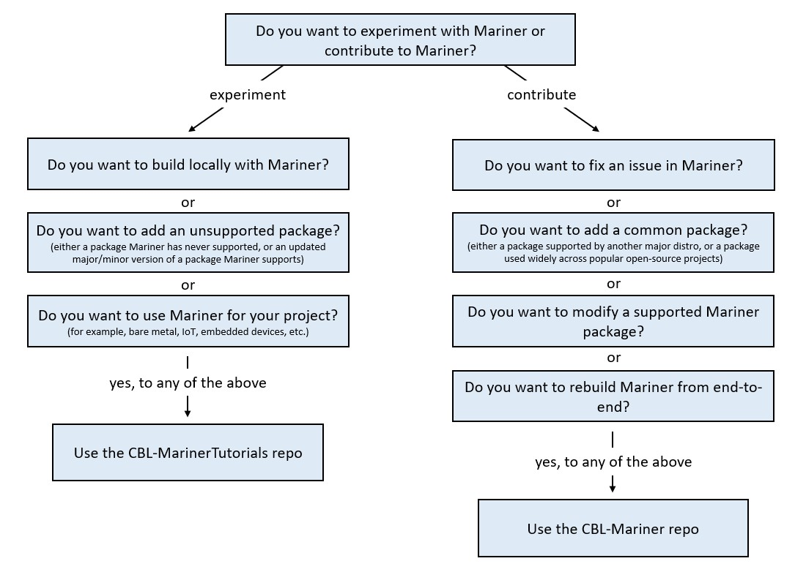

# Introduction

The [CBL-Mariner](https://github.com/microsoft/CBL-Mariner) repository provides detailed instructions for building CBL-Mariner from end-to-end.  While it is possible to clone CBL-Mariner and build packages or images from that environment, for most users, it is _not the recommended approach_.  Usually it is best to work in a smaller, problem focused environment where you can quickly build just what you need, and rely on the fact that the curated CBL-Mariner packages are already available in the cloud. In this way, you can customize an image with your preferred disk layout or adding supplemental packages that CBL-Mariner may not provide.  If you are building a product based on CBL-Mariner, you may want your own repository with just the minimal set of packages for your business needs.  This repo, the CBL-MarinerTutorials repo, provides a basic template for getting started.  From here you can create a CBL-Mariner based product (aka a Derivative Image) or you may generate quick experimental or debug builds to try out new ideas.

When you build an ISO, VHD or VHDX image from this repository,  the resulting image will contain additional content unavailable in the CBL-Mariner repo.  The CBL-MarinerTutorials repository demonstrates how you can augment CBL-Mariner without forking the CBL-Mariner repository.  This repository contains the SPEC file and source for building a simple "Hello World" application.  This repository also includes a simple "os-subrelease" package that allows you to add identifying information about your derivative to an /etc/os-subrelease file.  

Follow this decision tree to ensure you are using the correct repository for your use case:

The following tutorials guide you through the process of building and running the basic CBL-MarinerTutorials image.  These instructions also describe how to customize or extend the basic CBL-MarinerTutorials image.

# Tutorial Table of Contents

- [Getting Started](docs/getting_started/prepare_environment.md)
    - Tutorial: Prepare your Environment
- [Working with Packages](docs/packages/working_with_packages.md)
    - Image Config File
    - Tutorial: Customize your Image with Pre-built Packages
    - Tutorial: Customize your Image with Unsupported Packages
- [Modify the Kernel](docs/kernel/modify_kernel.md)
    - Tutorial: Modify the Image Kernel
- [Building an Image](docs/building/building.md)
    - Tutorial: Build a Demo VHD or VHDX Image
    - Tutorial: Build a Demo ISO Image
    - [Automate VHD or VHDX Creation 'packer'](imaging-from-packer/Readme.md)