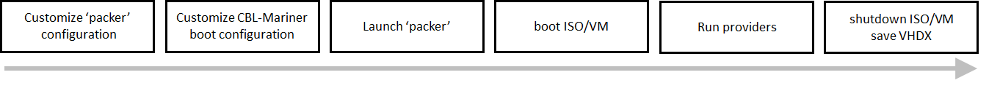

# Automate VHD or VHDX creation from CBL-Mariner ISO image using ['packer']( https://www.packer.io/) (1)
This set of scripts and configuration files can be used to automate VHDX (2) creation and customization from an initial CBL-Mariner ISO image. **These scripts are designed to run on Windows using the Hyper-V builder Packer provides**. They will need to be adapted if another builder is used (e.g. qemu builder).
The ISO image can be local or fetched from a server. The ++original ISO image must contains 'openssh-server' packages++, because 'packer' relies on ssh to communicate with the VM once it has been programmatically configured and booted.

This tooling relies on two configuration files: 'packer' configuration [packer_config.json](https://github.com/microsoft/CBL-MarinerDemo/blob/main/imaging-from-packer/packer_config.json) and CBL-Mariner image configuration [mariner_config.json](https://github.com/microsoft/CBL-MarinerDemo/blob/main/imaging-from-packer/mariner_config.json) (aka unattended configuration) that are customized using a PowerShell script [Create-VM.ps1](https://github.com/microsoft/CBL-MarinerDemo/blob/main/imaging-from-packer/Create-VM.ps1). This PowerShell script will also launch 'packer' to create the VHDX. Once the VM has boot and after its initial configuration has been applied 'packer' will use its provisioners (1) to launch customization scripts which can be use to install new packages. 

Notes:
- this sample relies on the http server 'packer' will set up to provision the configuration files on the target. Consequently the Hyper-V virtual switch you will instruct 'packer' to use should be configured in such a way that communication between 'packer' http server and the target is possible. If not possible, packer offers other way to provision file onto the target, e.g.: secondary iso, (see 'packer' documentation).
- depending on the hardware it run against, the virtual machine Packer creates might be slow to boot and makes Packer injecting its "boot_command" before the virtual machine is ready to accept them. In such a case, use "boot_wait" in Packer config to delay injection of commands indicated in "boot_command".

###### Prerequisits
- enable Hyper-V feature on your Windows machine
- install 'packer' on your Windows machine

###### Notes
(1) For more information about 'packer' see https://www.packer.io/ and more specifically the [hyper-v builder](https://www.packer.io/docs/builders/hyperv/iso)
(2) VHD creation just requires to change 1 parameter in the 'packer' configuration file and some changes in mariner configuration file (specifically the boot partition).
See [CBL-Mariner image configuration](https://github.com/microsoft/CBL-Mariner/blob/1.0/toolkit/docs/formats/imageconfig.md), you may also take a look at [CBL-Mariner core legacy config file](https://github.com/microsoft/CBL-Mariner/blob/1.0/toolkit/imageconfigs/core-legacy.json) to figure out how the boot partition can be set.
(3) This is available for **CBL-Mariner version 1.0.20210929 and above**

